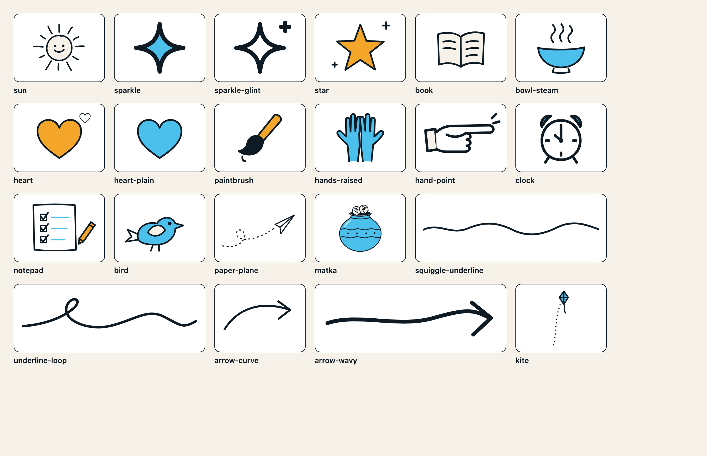
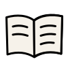
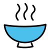
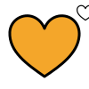
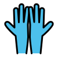
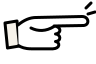
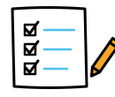
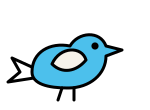
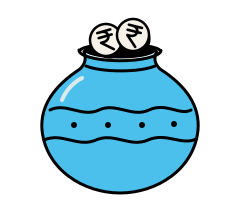

# Illustrations

The brand's hand-drawn doodle vocabulary (brand guide p. 15, Graphic language), one standalone SVG each. These are the shared doodles used by the guide, marketing templates and the React `Doodle` component. Section-specific website art (the footer street scenes, the Kalakriti bunting, the programme connector line and the footer margin outlines) stays in the website repo. The light outline set the website scatters in its margins is shared, and lives in [`outline/`](#outline-doodles-outline). They were extracted from the site's inline SVG by `scripts/build-illustrations.ts` and optimised with svgo. These files are the source of truth: edit them here.

`contact-sheet.png` is rendered by `bun run illustrations:sheet`. `manifest.json` lists every file with its title, viewBox, stretch flag and animation hooks. `bun run check` validates it.

## How they are drawn

- **One line:** the root sets `fill="none" stroke="currentColor"`, round caps and joins, and the line width. That's 3, except the kite (2.25, non-scaling, as drawn in the site's street scene). Set CSS `color` to recolour the line. Ink fills (eyes, the matka rim, the brush bristles) also use `currentColor`.
- **Palette fills** are hex literals: sky `#4CC0EC`, marigold `#F4A62A`, paper `#F6F2EA`, paper 2 `#EFE9DE` and white. Presentation attributes lose to any CSS rule, so `.my-doodle path { fill: var(--pi-sky) }` overrides them.
- **viewBox:** always starts at `0 0`. The paintbrush's original box had an offset (`1.4 -1 100 100`) and the kite is cropped from the street scene; their content is translated instead.
- **Stretchers:** `squiggle-underline` and `underline-loop` have `preserveAspectRatio="none"` so they can be stretched under a word.
- **Inline or ``:** inline the SVG (or use it as a mask) if the line should follow `color` or be animated. As an ``, `currentColor` resolves to black.

## Animation hooks

The website animates doodles by **class**, not id, so the optimiser kept these classes and dropped the styling-only ones (`ln`, `ft-ln`, `s`, `f2`, `fp`, `ac`, …). No ids are needed. svgo runs with `cleanupIds`, `collapseGroups`, `mergePaths`, `convertShapeToPath`, `removeEmptyContainers` and the group/element attribute movers turned off, so every hook keeps its element and its group.

| Hook | What the site does with it |
|---|---|
| `sun` `.rays`, `.wink` | Rays spin or breathe around 60 60. One eye winks |
| `book` `.leaf` | Page turns around 50 57 |
| `bowl-steam` `.steam`, `.s1`–`.s3` | Steam wisps rise, staggered |
| `heart` `.beat`, `.mini` | Heartbeat, with the mini heart popping |
| `star` / `sparkle-glint` `.tw`, `.glint` | Twinkle and glint |
| `clock` `.hand`, `.bells` | Hand ticks around 32 35. Bells ring around 32 14 |
| `notepad` `.tk` `.t1`–`.t3`, `.pencil` | Ticks draw on (`pathLength="1"`). Pencil writes |
| `bird` `.hop`, `.wing` | Hops |
| `hand-point` `.nudge__hand` | Scroll nudge |
| `matka` `.rest`, `.coins`, `.pot` | Pot bobs. site.js drops rupee coins into the empty `.coins` group |
| `kite` `.kite` | Sways from the string end |

Keyframes live in the site CSS. This package ships only the hook classes; neither its CSS nor the React `Doodle` animates them.

## Files

| | File | What | viewBox | Hooks |
|---|---|---|---|---|
|  | `sun.svg` | Smiling sun with rays (winks) | `0 0 120 120` | `rays`, `wink` |
|  | `sparkle.svg` | Four-point sparkle | `0 0 40 40` | – |
|  | `sparkle-glint.svg` | Sparkle with a glint | `0 0 40 40` | `tw`, `glint` |
|  | `star.svg` | Five-point star with glints | `0 0 100 100` | `tw`, `glint` |
|  | `book.svg` | Open book, page turning (Teach) | `0 0 100 100` | `leaf` |
|  | `bowl-steam.svg` | Bowl with rising steam (Feed) | `0 0 100 100` | `steam`, `s1`, `s2`, `s3` |
|  | `heart.svg` | Beating heart with a mini heart (Gather) | `0 0 100 100` | `beat`, `mini` |
|  | `heart-plain.svg` | Heart, sky fill | `0 0 100 100` | – |
|  | `paintbrush.svg` | Paintbrush (Kalakriti nav icon) | `0 0 100 100` | – |
|  | `hands-raised.svg` | Two raised hands (Volunteer) | `0 0 100 100` | – |
|  | `hand-point.svg` | Pointing hand (scroll nudge) | `0 0 96 64` | `nudge__hand` |
|  | `clock.svg` | Alarm clock (ticks and rings) | `0 0 64 64` | `bells`, `hand` |
|  | `notepad.svg` | Checklist notepad with pencil | `0 0 130 110` | `tk`, `t1`, `t2`, `t3`, `pencil` |
|  | `bird.svg` | Bird (hops) | `0 0 150 110` | `hop`, `wing` |
|  | `paper-plane.svg` | Paper plane with a looping dashed trail | `0 0 220 120` | – |
|  | `matka.svg` | Matka (clay pot) with two rupee coins | `0 0 240 210` | `rest`, `coins`, `pot` |
|  | `squiggle-underline.svg` | Squiggle underline | `0 0 300 30` (stretch) | – |
|  | `underline-loop.svg` | Underline with a loop | `0 0 220 60` (stretch) | – |
|  | `arrow-curve.svg` | Curved arrow | `0 0 120 70` | – |
|  | `arrow-wavy.svg` | Wavy arrow | `0 0 140 40` | – |
|  | `kite.svg` | Kite on a dotted string (from the street scene) | `0 0 62 202` | `kite` |

## Website equivalents

The website ([proud-indian-ngo/website](https://github.com/proud-indian-ngo/website)) has 29 doodle components in `src/components/doodles/`. 28 of them are brand doodles, and every one maps onto the 21 files here. Several components share one file: the art is the same, with one hook class removed, a different stroke or an offset viewBox. `manifest.json` records the mapping in `website`. The only one left in the site is `Ring`, the Reports 95% progress ring, which is a data graphic. No generic doodle is missing.

| File | Website component(s) |
|---|---|
| `sun` | HeroSun (no .wink), CollageSun |
| `sparkle` | Sparkle |
| `sparkle-glint` | KalaSparkle |
| `star` | PosterStar |
| `book` | Book, IndexBook (no .leaf) |
| `bowl-steam` | Bowl, IndexBowl |
| `heart` | HeartBeat |
| `heart-plain` | HeartBadge, HeartChip (stroke 6) |
| `paintbrush` | IndexBrush |
| `hands-raised` | HandsUp, IndexHands |
| `hand-point` | NudgeHand |
| `clock` | AlarmClock |
| `notepad` | Notepad |
| `bird` | PerchedBird, ClosingBird (no .hop) |
| `paper-plane` | ClosingPlane |
| `matka` | Matka |
| `squiggle-underline` | Squiggle, ClosingSquiggle |
| `underline-loop` | UnderlineLoop |
| `arrow-curve` | TicketArrow |
| `arrow-wavy` | StepArrow, SwipeArrow (head at x 100–114) |
| `kite` | – (cropped from the footer street scene) |

In React use `<Doodle name="…" />` from `@proudindian/design/react`; it inlines these files so the line follows CSS `color` and the hook classes can be animated.

## Not included

- **Logo, seals and favicon:** they live in `../logo/`.
- **Website-only art (in the website repo):** both street scenes, `bunting`, `connector-curve` and the seven footer margin outlines (pencil, book, kite, heart, star, brush, rupee coin).
- **UI icons:** the 16 px map pin and clock in the event meta, the social icons, the play/pause toggle and the progress ring. They are interface glyphs, not doodles.
- **The flying paper plane and its trail:** the site computes that path at runtime. The static `paper-plane.svg` is the footer version.

## Outline doodles (`outline/`)

A second, lighter set: 18 one-line outline doodles that the website scatters in its side margins. They are never animated and always decorative.

- **Files:** `outline/<name>.svg`, standalone: the root sets `fill="none" stroke="currentColor" stroke-width="1.4"`, round caps and joins, and every path has `vector-effect="non-scaling-stroke"`, so the line is 1.4px at any size. Optimised with svgo (multipass, precision 2). Unlike the main set, the viewBox keeps the drawing's own box (`notepad` is `8 4 96 100`, for example), so the aspect ratio is the drawing's.
- **Sprite:** `outline-sprite.svg`, one `<symbol id="pi-outline-<name>">` per file with no presentation attributes, so the page styles the line from the `<svg>` that `<use>`s it (`css/outline.css`, or the `--doodle-outline-*` tokens). Inline it once, hidden, or only the symbols you need.
- **Manifest:** `outline/manifest.json` (name, file, title, viewBox, aspect, bytes).
- **Build:** edit or add `outline/<name>.svg`, list it in `TITLES` in `scripts/build-outline.ts`, then `bun run outline`. `bun run check` fails if the sprite or manifest is stale, or a source has fills, classes or scaling strokes.
- **Contrast:** ink at 0.42 on paper (2.61:1), ink at 0.47 on sky (2.57:1), paper at 0.3 on ink (2.56:1), matched to the footer's own margin doodles. The tokens are `--doodle-outline-on-paper`, `--doodle-outline-on-sky` and `--doodle-outline-on-ink`.

| | Name | Title | viewBox |
|---|---|---|---|
|  | `pencil` | Pencil | `0 0 80 80` |
|  | `book` | Open book | `0 0 80 80` |
|  | `kite` | Kite with a bowed tail | `0 0 80 110` |
|  | `heart` | Heart | `0 0 80 80` |
|  | `star` | Five-point star | `0 0 60 60` |
|  | `rupee` | Rupee coin | `0 0 80 80` |
|  | `sun` | Smiling sun with rays | `0 0 120 120` |
|  | `sparkle` | Four-point sparkle | `0 0 40 40` |
|  | `notepad` | Checklist notepad | `8 4 96 100` |
|  | `clock` | Alarm clock | `4 3 56 60` |
|  | `plane` | Paper plane with a trail | `0 18 220 100` |
|  | `matka` | Matka (clay pot) | `36 36 168 162` |
|  | `brush` | Paintbrush | `0 0 80 80` |
|  | `bowl` | Bowl with rising steam | `5 3 90 94` |
|  | `hands` | Two raised hands | `5 5 90 90` |
|  | `note` | Music notes | `4 4 56 68` |
|  | `drum` | Dhol (drum) | `4 4 82 52` |
|  | `tick` | Tick in a circle | `8 8 64 64` |
